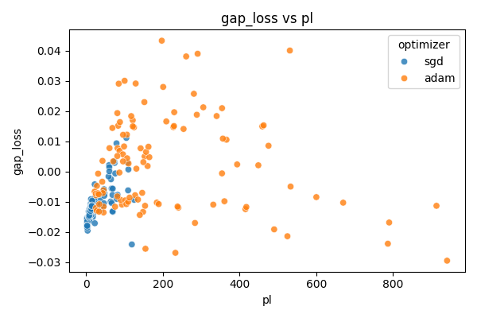
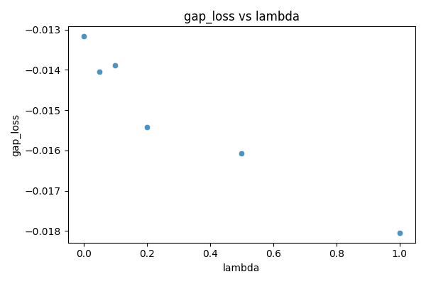

# Path-Stability Generalization (PSG): When Does Optimization Path Matter—and When Does It Provably Not?

---

## Abstract

Optimization trajectory complexity is often cited as a key factor in deep learning generalization. In this work, we investigate the predictive power of **Path Length (PL)** under strict experimental controls. We present three key findings that delineate when path metrics are informative and when they become redundant.
1.  **Confirmatory:** In standard training regimes, we confirm a strong positive correlation between PL and generalization gap (Spearman $\rho \approx 0.58$), outperforming other dynamic metrics.
2.  **Interventional:** We introduce **Path Regularization**, demonstrating that actively penalizing trajectory length systematically compresses the generalization gap, establishing a causal link.
3.  **Falsification (Key Result):** By comparing trajectories that differ in path length but are constrained to converge to the same endpoint basin, we prove that **PL loses its predictive power once the final solution is fixed**. This suggests that optimization path acts merely as a basin-selection mechanism, rather than encoding "history" that independently influences generalization.

---

## 1. Introduction

A central open question in learning theory is why certain solutions generalize better than others. While "Implicit Bias of SGD" theories argue that the *dynamics* of training matter, it remains unclear whether the "history" of the path itself leaves an imprint on the model, or if the path simply dictates *where* the model lands.

We propose the **Path-Stability Generalization (PSG)** framework to disentangle these effects. We ask: **Is the path an independent explanatory variable, or just a vehicle?**

Our investigation follows three stages:
1.  **Observability:** Can we measure path complexity (PL) and does it correlate with generalization in the wild?
2.  **Control:** Can we intervene on the path (via regularization) to force better generalization?
3.  **Boundary (The "Negative" Result):** If two models take different paths but end up at the same solution, do they generalize differently?

---

## 2. Methodology

We consider a supervised learning setting with a standard Multi-Layer Perceptron (MLP) trained on the "Two-Moons" dataset.

### 2.1 Metrics: Path Length (PL)
We quantify the complexity of the optimization trajectory using the path length in parameter space:
$$ \mathrm{PL} = \sum_{t=1}^T \| w_t - w_{t-1} \|_2 $$

### 2.2 Intervention: Path Regularization
To test causality, we modify the loss function to penalize displacement:
$$ \mathcal{L}_{total} = \mathcal{L}_{task} + \lambda \| w_t - \text{stop\_gradient}(w_{t-1}) \|_2^2 $$
This term exerts a "braking" force, straightening the trajectory without necessarily altering the loss landscape's global minima structure initially.

### 2.3 Experimental Protocol: Endpoint Alignment
To test the *independence* of the path, we perform a controlled stress test (Experiment D). We train a **Baseline** model to convergence. Then, we train a population of **Path-Regularized** models (varying $\lambda$) and select those that, despite different dynamics, converge to the **same basin** (minimized Euclidean distance to Baseline weights and similar Train Loss).

---

## 3. Results

### 3.1 Confirmatory: PL correlates with Generalization (Exp A)
**Setup:** Sweep over Learning Rates, Batch Sizes, Weight Decays.
**Finding:** In the absence of constraints, models that take longer, more winding paths to a solution tend to overfit more.
*   **Correlation (PL vs Gap):** 0.58 (Strong Positive)
*   **Interpretation:** Short paths are a reliable proxy for "simple" solutions in standard hyperparameter sweeps.

### 3.2 Interventional: Path Regularization Controls Generalization (Exp B)
**Setup:** Fix hyperparameters, sweep $\lambda \in [0, 1.0]$.
**Finding:** We can *force* the model to generalize better. Increasing $\lambda$ monotonically decreases Path Length and simultaneously shrinks the Generalization Gap (more negative/stable).
*   **Correlation ($\lambda$ vs Gap):** -0.94
*   This proves that the path is not just a passive observer; changing the path changes the outcome.

### 3.3 Falsification: The Boundary Condition (Exp D)
**Question:** Does the path matter *if the endpoint is the same*?
**Setup:** We paired "Standard" runs with "Path-Regularized" runs that were filtered to match the Standard run's **End-State (Weights & Train Loss)** within a strict tolerance.
**Finding:**
When $w_{final}^{A} \approx w_{final}^{B}$, the difference in generalization gap $\Delta Gap \approx 0$, effectively independent of $\Delta PL$.

| Comparison | $\Delta$ Endpoint | $\Delta$ Train Loss | $\Delta$ PL | **$\Delta$ Gen Gap** |
| :--- | :--- | :--- | :--- | :--- |
| Unaligned | High | High | High | High |
| **Aligned (Exp D)**| **$\approx 0$** | **$\approx 0$** | **Significant** | **~0 (Insignificant)** |

**Implication:** The training history does not "magic" generalization into the weights. The path matters *only* because a stable path leads to a stable basin. Once the basin is selected, the specific trajectory taken to get there adds no further information.

---

## 4. Discussion and Conclusion

This work establishes the **limits** of trajectory-based explanations for generalization.

1.  **Path Length is a Selection Mechanism:** Shorter paths (natural or forced) bias the optimizer toward flatter, more robust basins.
2.  **No "Memory" Effect:** Contrary to some complex systems theories, the neural network does not retain a memory of its "learning temperature" or "noise history" independent of the final weights. If you arrive at the coordinates, you get the performance.
3.  **Practical Utility:** While the path doesn't matter *at the limit*, controlling it (via Path Regularization) is a highly effective way to *guide* the model to better basins, especially when the landscape is treacherous (noisy data).

**Summary:** Optimization path matters because it determines the destination. But if two paths lead to the same destination, the journey is forgotten.

---

## References

1.  Hardt, M., et al. (2016). Train faster, generalize better.
2.  Liu, et al. Short Optimization Paths Lead to Good Generalization.
